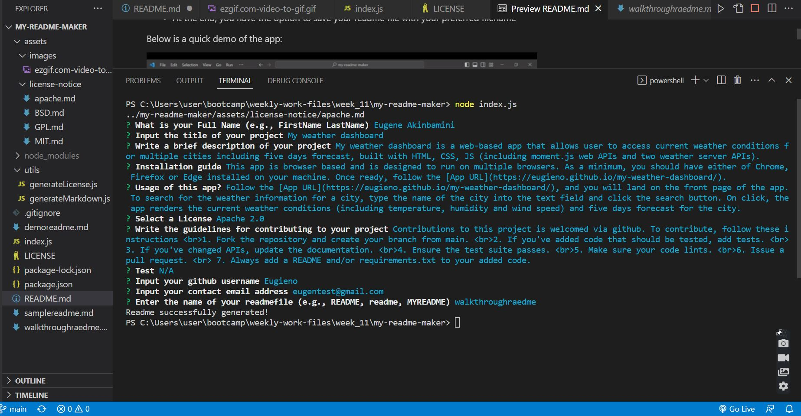

# my-readme-maker

## Description
My readme maker is a CLI based app that automatically generate a professional readme file for a user's project based on the user's response to specific questions asked, built with node.js, jS and the inquirer package.

## Installation
Make sure you have node installed on your local machine

## Usage
* Download or clone the directory unto your local machine
* Open the directory via your command line tool 
* In your command line, run the code  ```node index```
* Answer the questions following.
* At the end, you have the option to save your readme file with your preferred filename

Below is a screenshot of the app in use:




## License
[MIT](https://github.com/Eugieno/my-readme-maker/LICENSE)


## Contributing
Your contribution is welcomed on this project. To contribute, please follow these guide;
1.	Fork the repository and create your branch from main.
2.	If you've added code that should be tested, add tests.
3.	If you've changed APIs, update the documentation.
4.	Ensure the test suite passes.
5.	Make sure your code lints.
6.	Issue that pull request!
7.	Always add a README and/or requirements.txt to your added code.

## Questions
Feel free to contact me for additional questions and I will get back to you  
  * Email: [eugeneakinson@gmail.com ](#)       
  * Github profile: [Eugieno](https://github.com/Eugieno)

## Reflection
This project was completed at the end of my 11th week at the University of Birmingham bootcamp in FE web dev. 

The main goal of this project was to apply the knowledge gained working with node.js and specifically inquirer package,during the week. 

I had little or no challege in executing each of the acceptance criteria for this project. The most enjoyable part was reading inquirer and markdown file documentations, reviewing other developers readme files for inspiration and researching bits of information on the web on how to optimise the quality of a readme file; Specifically, I have learned the following; how to create a badge in readme.md file, how to add a block of code in readme file, how to add line breaks and many others. 

In summary, as a result of this project, I have improved my knowledge of the inquirer package and gained new techniques in formatting markdown files. 

## Upcoming (New) Features
In the immediate future, I plan to include the following features to extend the functonality and UI/UX of this CLI app.

1. Images that illustrates the headings and gives the readme file more elegant visual
2. More badges, such as a download badge; to allow the user monitor the amount of the public's engagement with their project. 